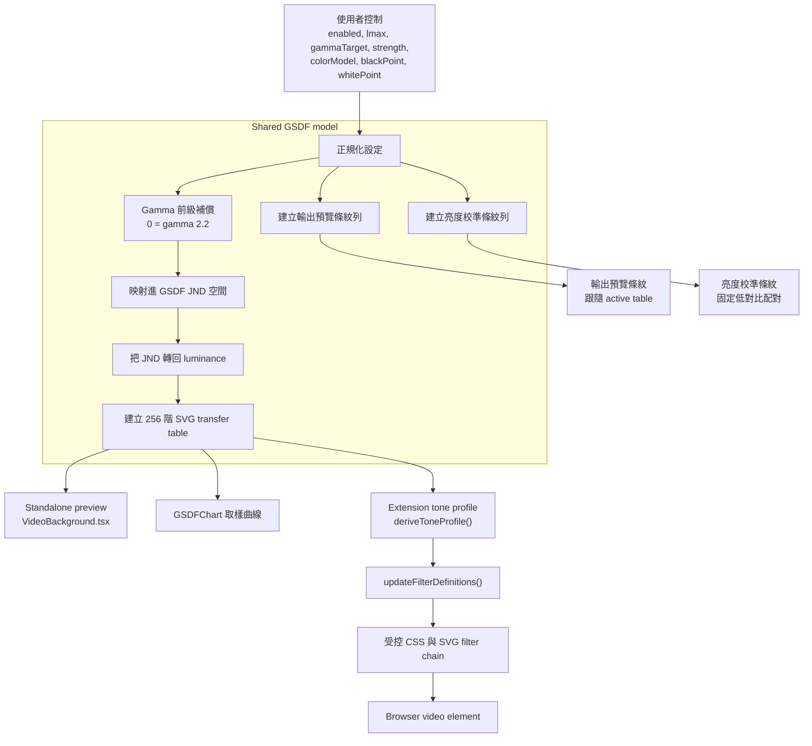

# GSDF EOTF Video Adjuster


把影片灰階重新整理成更穩定的 JND 階調，讓細微亮度差更容易分辨。

GSDF EOTF Video Adjuster 是一個精簡的 Chrome Manifest V3 extension 與本機 preview 工具，專注於顯示端感知亮度補救。當影片因後期調整不佳、螢幕 EOTF 不準確，或觀看環境不匹配而顯得暗部壓死、亮部不穩或階調不均時，它提供 Gamma 補償、目標亮度與 GSDF-inspired 灰階重新分布控制，讓亮度差異維持更穩定的可分辨性。

本專案的立論基礎是顯示端處理：它最佳化的是已經進入顯示路徑的訊號，而不是重新詮釋素材來源 coding。在一般 gamma 觀影基準之後，GSDF 階段會把可用灰階訊號處理成更接近人眼感知等距的 JND 階調，涵蓋暗部、中間調到亮部。

它適合作為特殊情境下的實用觀影補救工具，不取代正確調色、校正後的 mastering 或醫療顯示認證。此專案可以作為本機 standalone preview 執行；正式 extension 路徑則會把同一份 UI 打包成 Chrome extension iframe，並在偵測到的 video element 上注入受控 SVG filter。

## GSDF 亮度模型

目前的核心流程是：

```text
gammaTarget 前級補償
-> GSDF luminance/JND 重新映射
-> 產生 SVG transfer table
-> 以 filter amount 混合回 gamma-adjusted baseline
```

實際上，一個輸入影片亮度層級會先經過目前選定的 Gamma 目標，再送進 GSDF 亮度模型，最後依照 filter amount 拉回到 gamma-adjusted baseline。這樣可以把它維持在「觀影補救層」的角色，而不是強迫全域做一次全有或全無的重映射。



完整公式、實作細節與延伸流程圖請見 [docs/gsdf-model.ZHTW.md](docs/gsdf-model.ZHTW.md) 與 [docs/gsdf-application-and-ui-review.ZHTW.md](docs/gsdf-application-and-ui-review.ZHTW.md)。

## 測試圖

測試圖區塊待補。這裡預留給 before/after 擷圖、條紋比較，以及最能看出 GSDF rescue 效果的灰階困難案例。

## 直接使用與安裝

目前最快的使用方式是走 unpacked Chrome extension 流程：

1. 先用 `npm ci` 安裝 dependencies。
2. 執行 `npm run build:ext` 建置 extension UI。
3. 開啟 `chrome://extensions`。
4. 啟用 Developer mode。
5. 選擇 Load unpacked。
6. 選取此 repo 的 `extension` 目錄。

載入後，到支援的影片頁面點一下 extension action，就可以切換 GSDF 控制面板。

專案未來可以打包，但目前不建議把打包版當成預設主路徑。現階段 UI 行為、濾鏡調整與 extension smoke 驗證都還在持續迭代中，因此 `build:ext` 加上 Load unpacked 的工作流仍然最實用。等安裝表面、權限需求與 regression workflow 都穩定後，再做 zip 套件或 Chrome Web Store 形式的 release 會更划算。

## 它提供什麼

- 針對暗部、中間調或亮部階調分離不足的影片，提供顯示端 tonal rescue。
- 以 JND 為導向的 GSDF 灰階重新分布，讓細節分辨更穩定。
- GSDF 之前的 Gamma 補償控制：中央 `0 = gamma 2.2`，往左可到 gamma 3.0 的暗環境補償，往右可到 gamma 1.0 線性補償。
- 10 到 500 nits 的對數式目標亮度控制。
- Filter 總量控制：決定完整 GSDF output 與 gamma-adjusted signal 的混合比例。
- RGB 與 YCbCr/luma-only filter 路徑，可依觀影優先順序選擇。
- 黑位、白位、細節銳化與色溫偏移控制，用於實務補救微調。
- 精簡與展開版 GSDF 條紋測試視圖，方便視覺檢查。
- Chrome extension action fallback：頁面重載或 content script 尚未就緒時仍可嘗試啟動。

## 專案結構

- `src/`：standalone React UI 與共用 GSDF model helpers。
- `extension/manifest.json`：Manifest V3 extension 定義。
- `extension/background.js`：extension action click 啟動與 injection fallback。
- `extension/content.js`：注入 iframe UI 並套用受控 video filters。
- `scripts/buildExt.js`：把 Vite build 複製到 extension package。
- `scripts/smokeExtensionChrome.mjs`：執行真實 Chrome extension smoke test。
- `tests/`：Node regression tests，涵蓋 model、content script、background script、manifest 與 panel layout。

## 需求

- 建議使用 Node.js 22 或更新版本。
- npm。
- 只有執行 `npm run smoke:ext` 時需要 Google Chrome。

目前的 app 不需要 Gemini 或其他雲端 API key。

## 開發

安裝 dependencies：

```powershell
npm ci
```

啟動 standalone Vite app：

```powershell
npm run dev
```

開啟 `http://127.0.0.1:3000` 或 `http://localhost:3000`。

## Chrome Extension Build

建置 web app，並把產物複製到 `extension/ui`：

```powershell
npm run build:ext
```

這個步驟會準備好讓 Chrome 從 `extension` 目錄載入的 unpacked extension 資產。

## 驗證

執行快速測試：

```powershell
npm test
```

執行 TypeScript 驗證：

```powershell
npm run lint
```

執行 production web build：

```powershell
npm run build
```

建置 extension UI 後執行 extension smoke test：

```powershell
npm run build:ext
npm run smoke:ext
```

`smoke:ext` 會用暫存 profile 啟動 Chromium 或 Chrome、載入 unpacked extension、切換控制面板，並把截圖寫到 `output/playwright`。它會優先使用 `CHROME_PATH`；若未設定，會先嘗試最新的本機 Playwright Chromium，再退回預設 Google Chrome 路徑。

如果 browser 安裝在其他位置，請先設定 `CHROME_PATH`：

```powershell
$env:CHROME_PATH = 'C:\Path\To\chrome.exe'
npm run smoke:ext
```

如果受管理的 Google Chrome 擋下 command-line unpacked extension loading，可以把 `CHROME_PATH` 指到本機 Chromium build：

```powershell
$env:CHROME_PATH = "$env:LOCALAPPDATA\ms-playwright\chromium-1217\chrome-win64\chrome.exe"
npm run smoke:ext
```
