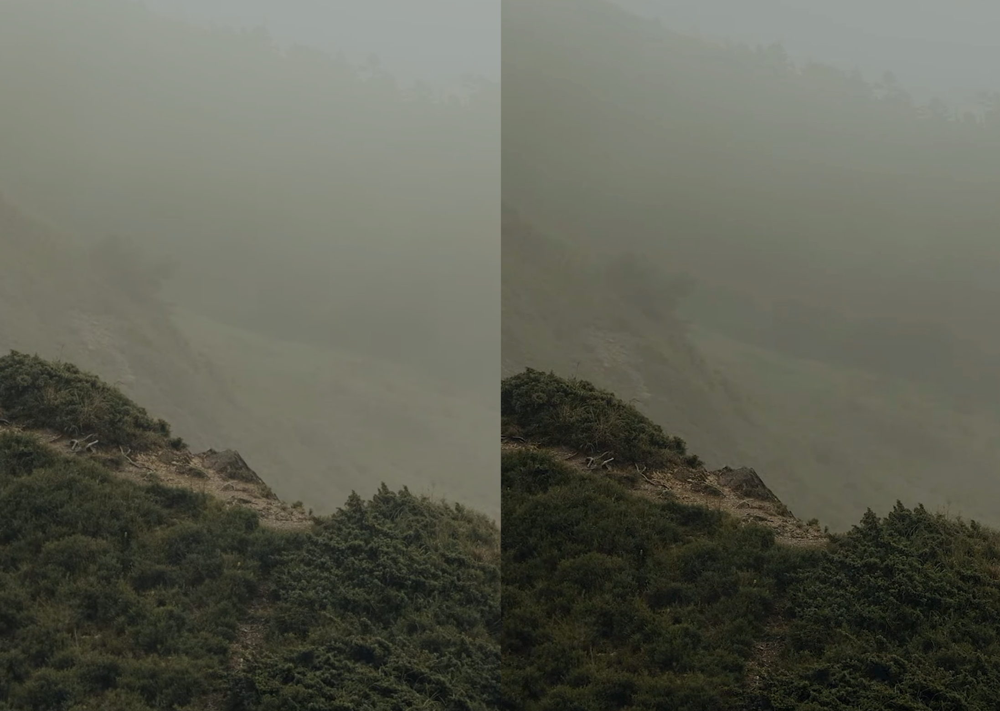
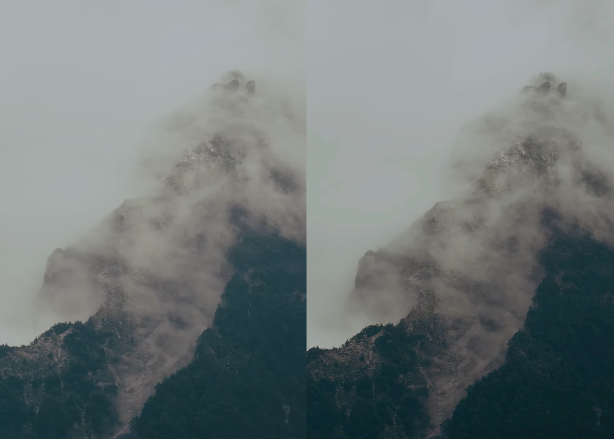
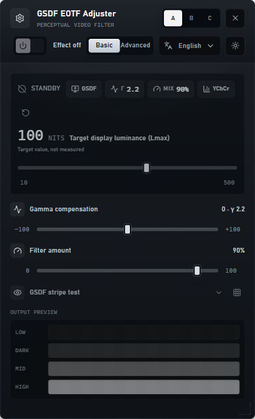
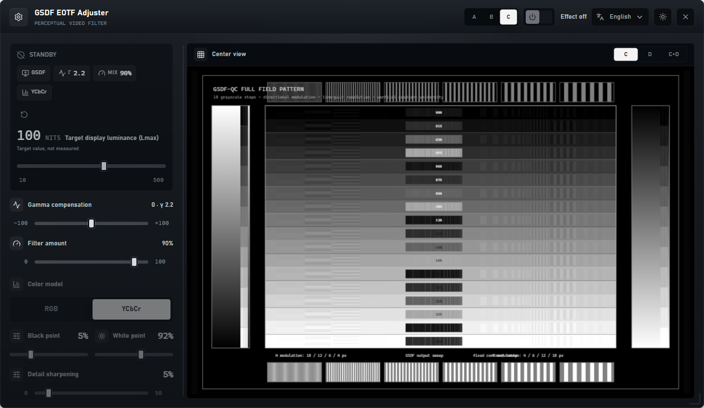
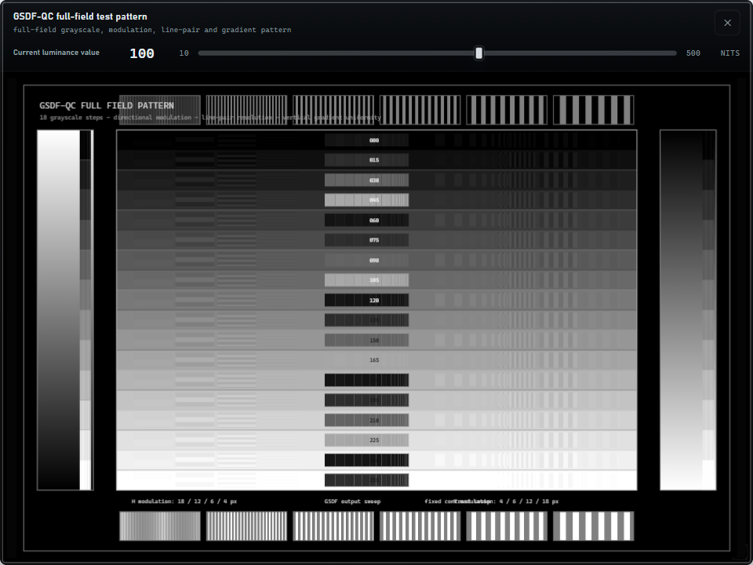
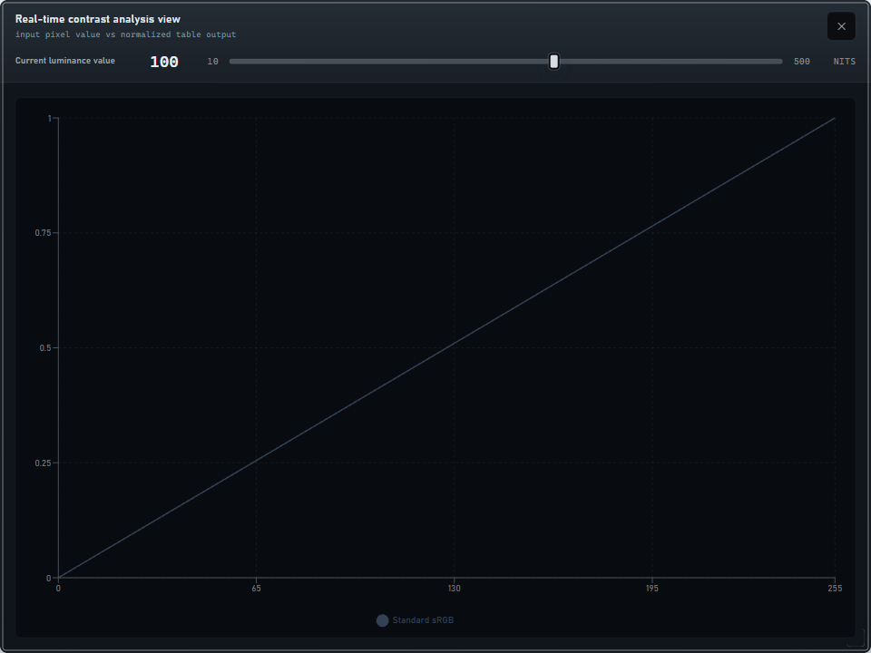

[](assets/readme-banner.png)

# GSDF EOTF Video Adjuster


**Display-side grayscale rescue for web video that loses shadow, haze, and low-contrast detail.**

[Overview](#-overview) · [Quick Start](#-quick-start) · [Permissions](#-permissions-and-privacy) · [Features](#-features) · [Screenshots](#-screenshots) · [Controls](#-controls) · [Architecture](#-architecture) · [Development](#-development) · [Documentation](#-documentation) · [Traditional Chinese](README.zh-tw.md)

---

## 🎯 Overview

**GSDF EOTF Video Adjuster** reshapes the visible luminance response of browser video with a compact Manifest V3 control panel. It is built for practical viewing rescue: foggy footage, crushed shadows, washed highlights, uneven display EOTF behavior, or viewing conditions where subtle grayscale steps become hard to separate.

| Capability | What it does |
|---|---|
| **GSDF-inspired luminance remap** | Rebuilds a 256-step transfer table from target luminance and JND spacing — steadier grayscale separation across dark, midtone, and bright regions |
| **Pre-GSDF gamma compensation** | Keeps normal gamma viewing as the baseline — then lets the GSDF layer operate as a controlled rescue pass |
| **Filter amount blend** | Mixes the full GSDF result back toward the gamma-adjusted baseline — useful when full correction is too strong |
| **Iframe control panel** | Injects a draggable extension UI over the page — compact A mode, split B mode, and expanded C inspection workspace |
| **Inspection patterns** | Provides output stripes, fixed calibration stripes, full-field GSDF-QC pattern, and live curve chart — quick visual checks before trusting a setting |

> **Recommended:** Treat it as a viewing aid, not as mastering, display calibration, HDR measurement, or DICOM compliance. Use the smallest correction that restores the detail you need.

---

## ⚠️ Limitations

This extension is a browser-side viewing aid.

It does not:

- calibrate a display,
- measure HDR or SDR luminance,
- certify DICOM PS3.14 conformance,
- replace display QA,
- modify source video files,
- guarantee consistent results across every player, DRM surface, canvas renderer, or site-specific video pipeline.

Compatibility depends on how each page renders video. Standard HTML video elements are the primary target; cross-origin frames, DRM playback, canvas rendering, and aggressive host-page styles may limit or change the visible effect.

---

## 🚀 Quick Start

### Installation

```powershell
# Clone the repository first if you are starting from Git
git clone <repo-url>
cd gsdf-eotf-video-adjuster

# Install dependencies
npm ci

# Build the extension UI into extension/ui
npm run build:ext
```

Then load the unpacked extension:

```text
1. Open chrome://extensions
2. Enable Developer mode
3. Choose Load unpacked
4. Select this repo's extension/ directory
5. Open a video page
6. Click the extension action to toggle the GSDF control panel
```

### Daily Use

| Step | Action |
|---|---|
| **Enable correction** | Toggle the panel switch from standby to active |
| **Set target luminance** | Adjust `Lmax` for the display/viewing target, from `10..500 nits` |
| **Balance gamma first** | Use Gamma compensation around `0 = gamma 2.2`, left toward `3.0`, right toward `1.0` |
| **Blend gently** | Reduce Filter amount if the full GSDF table looks too strong |
| **Inspect before trusting** | Check stripe preview, calibration stripes, full-field pattern, and curve chart |

---

## 🔐 Permissions and Privacy

The extension requests access to web pages so it can detect HTML video elements, inject the control panel, and apply a managed SVG/CSS filter chain to the active page.

| Permission | Why it is used |
|---|---|
| `activeTab` | Lets the toolbar action operate on the current tab |
| `scripting` | Injects or reinjects the content script when needed |
| `<all_urls>` host access | Lets the content script run across supported video pages |

No cloud API key is required. The extension runs locally in the browser and should still be treated as a viewing aid, not as medical calibration, DICOM conformance, or diagnostic display verification.

---

## ✨ Features

### 🧠 Perceptual Tone Model

| Feature | Description |
|---|---|
| **JND-oriented GSDF table** | DICOM PS3.14 luminance/JND relationship adapted into a browser SVG component-transfer table |
| **Gamma pre-compensation** | `gammaTarget` applied before GSDF — keeps the rescue layer anchored to a familiar video-viewing baseline |
| **Global filter amount** | `0%` keeps the gamma-adjusted signal, `100%` applies the full GSDF table, intermediate values blend between them |
| **Logarithmic luminance slider** | Finer control at lower luminance targets — practical for dim viewing and low-contrast footage |

### 🎛 Control Surface

| Area | Description |
|---|---|
| **A mode** | Default single panel — status, luminance, gamma, filter amount, stripe preview, and basic/advanced tabs |
| **B mode** | Split panel — basic controls and advanced image controls visible side by side |
| **C mode** | Expanded workspace — controls on the left, GSDF-QC pattern and chart views in the center |
| **Theme and language** | Dark/light panel themes plus English, Traditional Chinese, Simplified Chinese, and Japanese UI strings |

### 🧪 Visual Inspection

| Surface | Description |
|---|---|
| **Output preview stripes** | Generated from the active transfer table — follows current luminance, gamma, and filter settings |
| **Calibration stripes** | Fixed low-contrast code pairs — stable reference independent of the active GSDF table |
| **Full GSDF-QC pattern** | Multi-frequency grayscale, modulation, line-pair, and gradient checks |
| **Curve chart** | Input pixel value vs normalized output — compares the baseline gamma curve and the active GSDF-inspired transfer table |

---

## 📸 Screenshots

### Before / After Contrast Rescue

[](assets/readme-before-after-foggy-trail.png)

*Low-contrast terrain and haze — side-by-side comparison for practical grayscale separation.*

[](assets/readme-before-after-mountain-fog.png)

*Fog and rock detail — useful for judging whether the correction is improving separation or over-driving contrast.*

### Extension Control Panel

[](assets/readme-panel-basic.png)

*A mode — compact standby panel with luminance, gamma compensation, filter amount, and stripe preview.*

[](assets/readme-panel-expanded-workspace.png)

*C mode — left control column plus central GSDF-QC workspace for deeper inspection.*

### Diagnostic Views

[](assets/readme-diagnostic-pattern.png)

*Full-field grayscale, modulation, line-pair, and gradient diagnostic pattern.*

[](assets/readme-curve-chart.png)

*Real-time curve chart for the active transfer table.*

### Asset Notes

README screenshots and diagnostic images are project documentation assets unless otherwise noted. They are included for demonstration only and do not represent medical calibration, diagnostic display verification, or guaranteed results on all video content.

---

## ⌨️ Controls

No global keyboard shortcuts are registered yet. The extension is controlled from the injected panel.

| Control | Role |
|---|---|
| **Effect switch** | Enable or disable the active video correction |
| **A / B / C layout switch** | Choose compact, split, or expanded inspection workspace |
| **Basic / Advanced tabs** | Switch between core tone controls and image-level refinements in A mode |
| **Language selector** | Change UI language without rebuilding the extension |
| **Theme button** | Switch between dark and light panel styling |
| **Panel resize handles** | Resize the floating extension panel and expanded overlays |

---

## 🏗 Architecture

```text
src/
  App.tsx                         # React shell, settings persistence, extension message bridge
  types.ts                        # Shared settings shape, GSDF/JND math, transfer-table helpers
  components/
    DraggablePanel.tsx            # Extension control panel, layouts, inspection overlays
    GSDFChart.tsx                 # Responsive transfer-curve chart
    VideoBackground.tsx           # Standalone local preview video
  i18n/                           # UI language registry and localized copy
extension/
  manifest.json                   # Manifest V3 permissions, action, content script, web resources
  background.js                   # Action-click activation and injection fallback
  content.js                      # Iframe injection, video discovery, managed SVG filter chain
  ui/                             # Built extension UI copied by npm run build:ext
scripts/
  buildExt.js                     # Copies Vite build output into extension/ui
  smokeExtensionChrome.mjs        # Real Chrome/Chromium smoke test for the unpacked extension
tests/
  *.test.mjs                      # Node regression tests for model, manifest, content, layout
docs/
  gsdf-model.md                   # Formula and implementation notes
  gsdf-application-and-ui-review.md # GSDF usage, caveats, and UI review notes
```

### Module Overview

| Module | World | Role |
|---|---|---|
| `src/types.ts` | Shared app model | Normalizes settings, evaluates GSDF luminance/JND mapping, builds transfer tables and stripe rows |
| `src/components/DraggablePanel.tsx` | React UI | Presents A/B/C panel layouts, controls, stripe preview, and inspection overlays |
| `extension/content.js` | Host page content script | Injects the iframe UI, mirrors the model, discovers videos, and applies managed filters |
| `extension/background.js` | Extension service worker | Handles action clicks and reinjects the content script when needed |
| `scripts/smokeExtensionChrome.mjs` | Verification | Launches a real browser profile, loads the unpacked extension, toggles the panel, and captures evidence |

### Message Flow

```text
User adjusts panel
  -> React iframe posts GSDF_SETTINGS_CHANGED
  -> content script normalizes settings and derives tone profile
  -> SVG filter definitions are updated
  -> target videos are discovered or refreshed
  -> managed filter chain is applied without discarding host-page filters
```

---

## 🧪 Development

### Requirements

| Tool | Requirement |
|---|---|
| **Node.js** | Tested with Node.js 22.x; newer active LTS versions are expected to work |
| **npm** | Dependency install and scripts |
| **Chrome / Chromium** | Required for extension smoke testing |
| **Cloud API keys** | Not required |

### Commands

```powershell
# Run local standalone preview
npm run dev

# TypeScript validation
npm run lint

# Node regression tests
npm test

# Web production build
npm run build

# Build unpacked extension assets
npm run build:ext

# Launch real Chrome/Chromium extension smoke test
npm run smoke:ext
```

On Windows machines where managed Google Chrome blocks command-line unpacked extension loading, use the helper wrapper:

```powershell
npm run smoke:ext:env
```

The smoke runner writes local evidence under `output/playwright/`.

---

## 📄 Documentation

| Document | Description |
|---|---|
| [PRODUCT.md](PRODUCT.md) | Product framing and interface intent |
| [docs/gsdf-model.md](docs/gsdf-model.md) | GSDF formula source, browser approximation, and implementation pipeline |
| [docs/gsdf-model.ZHTW.md](docs/gsdf-model.ZHTW.md) | Traditional Chinese GSDF model notes |
| [docs/gsdf-application-and-ui-review.md](docs/gsdf-application-and-ui-review.md) | Formula review, UI review inputs, implemented corrections, and verification notes |
| [docs/gsdf-application-and-ui-review.ZHTW.md](docs/gsdf-application-and-ui-review.ZHTW.md) | Traditional Chinese review notes |

---

## 🤝 Contributing

Contributions are welcome. Open an issue first for changes that affect the GSDF model, browser filter behavior, permissions, or extension activation flow.

---

## 🤖 AI-Assisted Development

This project was developed with AI assistance.

| Model | Role |
|---|---|
| OpenAI Codex | Implementation support, documentation rewrite, screenshot workflow, and local verification |
| ChatGPT 5.5 Pro web UI | External README audit for caveat wording, permissions/privacy disclosure, Traditional Chinese clarity, and public positioning |

> **Disclaimer:** While the author has made every effort to review and validate
> the AI-generated code, no guarantee can be made regarding its correctness, security,
> or fitness for any particular purpose. Use at your own risk.
> External AI review is not an endorsement, certification, security audit, medical
> validation, or DICOM conformance assessment.

---

## 📜 License

[GNU General Public License v3.0 only](LICENSE). Proprietary or closed-source commercial redistribution requires a separate commercial license from the copyright holder.
