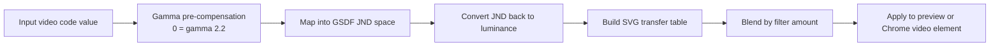

# GSDF EOTF Video Adjuster


Reshape video grayscale into steadier JND steps so subtle tonal detail stays easier to tell apart.

GSDF EOTF Video Adjuster is a compact Chrome Manifest V3 extension and local preview tool for display-side perceptual luminance rescue. When a video looks crushed, washed out, or uneven because the grading, display EOTF, or viewing environment does not line up, it gives you direct control over gamma compensation, target luminance, and GSDF-inspired grayscale redistribution that helps brightness differences remain consistently distinguishable.

The premise is deliberately display-side: the tool optimizes the signal that has already reached the display path, rather than reinterpreting the source material's coding. After the normal gamma viewing baseline, the GSDF stage reshapes the available grayscale signal into more perceptually even JND steps across dark, mid, and bright ranges.

Use it as a practical viewing aid for special cases, not as a replacement for proper color grading, calibrated mastering, or medical display certification. The app can run as a standalone local preview, and the production path packages the same UI into a Chrome extension iframe that injects managed SVG filters onto detected video elements.

## GSDF Luminance Model

The current canonical flow is:

```text
gammaTarget pre-compensation
-> GSDF luminance/JND remap
-> SVG transfer table generation
-> filter-amount blend over the gamma-adjusted baseline
```

In practice, one input video level first passes through the selected gamma target, then moves through the GSDF luminance model, and finally blends back toward the gamma-adjusted baseline by the chosen filter amount. That keeps the tool useful as a viewing rescue layer instead of forcing a full all-or-nothing remap.



The full formula notes, implementation details, and extended pipeline diagrams live in [docs/gsdf-model.md](docs/gsdf-model.md) and [docs/gsdf-application-and-ui-review.md](docs/gsdf-application-and-ui-review.md).

## Test Images

Test-image gallery is pending. This section is reserved for before/after captures, stripe comparisons, and difficult grayscale examples that show where GSDF rescue helps most.

## Direct Install and Use

The fastest path today is the unpacked Chrome extension workflow:

1. Install dependencies with `npm ci`.
2. Build the extension UI with `npm run build:ext`.
3. Open `chrome://extensions`.
4. Turn on Developer mode.
5. Choose Load unpacked.
6. Select this repo's `extension` directory.

After loading, open a supported video page and click the extension action to toggle the GSDF control panel.

Packaging is possible, but it is not the recommended default yet. Right now the project still benefits from the editable `build:ext` plus Load unpacked loop because UI behavior, filter tuning, and extension smoke validation are still part of active iteration. A packaged zip or Chrome Web Store-style release becomes more worthwhile once the install surface, permissions, and regression workflow stop moving as often.

## What It Gives You

- Display-side tonal rescue for video that loses shadow, midtone, or highlight separation.
- JND-oriented GSDF redistribution for steadier grayscale detail discrimination.
- Pre-GSDF gamma compensation centered at `0 = gamma 2.2`, with left-side dark-environment compensation up to gamma 3.0 and right-side linear compensation down to gamma 1.0.
- Logarithmic target-luminance control from 10 to 500 nits.
- Filter amount control for blending the full GSDF output with the gamma-adjusted signal.
- RGB and YCbCr/luma-only filter paths for different viewing priorities.
- Black point, white point, sharpness, and color-temperature controls for practical rescue tuning.
- Compact and expanded GSDF stripe test views for visual inspection.
- Chrome extension fallback activation when a page reloads or the content script is not ready.

## Project Layout

- `src/` contains the standalone React UI and shared GSDF model helpers.
- `extension/manifest.json` defines the Manifest V3 extension.
- `extension/background.js` owns action-click activation and injection fallback.
- `extension/content.js` injects the iframe UI and applies managed video filters.
- `scripts/buildExt.js` copies the Vite build into the extension package.
- `scripts/smokeExtensionChrome.mjs` runs the real Chrome extension smoke test.
- `tests/` contains Node-based regression tests for the model, content script, background script, manifest, and panel layout.

## Requirements

- Node.js 22 or newer is recommended.
- npm.
- Google Chrome is required only for `npm run smoke:ext`.

No Gemini or other cloud API key is required for the current app.

## Development

Install dependencies:

```powershell
npm ci
```

Run the standalone Vite app:

```powershell
npm run dev
```

Open `http://127.0.0.1:3000` or `http://localhost:3000`.

## Chrome Extension Build

Build the web app and copy the generated UI into `extension/ui`:

```powershell
npm run build:ext
```

The build step prepares the unpacked extension assets that Chrome loads from the `extension` directory.

## Verification

Run the fast test suite:

```powershell
npm test
```

Run TypeScript validation:

```powershell
npm run lint
```

Run the production web build:

```powershell
npm run build
```

Run the extension smoke test after building the extension UI:

```powershell
npm run build:ext
npm run smoke:ext
```

`smoke:ext` launches Chromium or Chrome with a temporary profile, loads the unpacked extension, toggles the panel, and writes a screenshot under `output/playwright`. It uses `CHROME_PATH` when set, otherwise it tries the newest local Playwright Chromium before falling back to the default Google Chrome path.

If the browser is installed somewhere else, set `CHROME_PATH` first:

```powershell
$env:CHROME_PATH = 'C:\Path\To\chrome.exe'
npm run smoke:ext
```

On machines where managed Google Chrome blocks command-line unpacked extension loading, point `CHROME_PATH` at a local Chromium build instead:

```powershell
$env:CHROME_PATH = "$env:LOCALAPPDATA\ms-playwright\chromium-1217\chrome-win64\chrome.exe"
npm run smoke:ext
```
