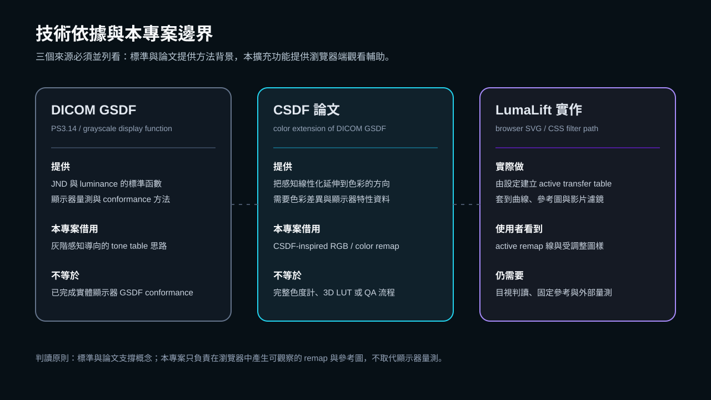
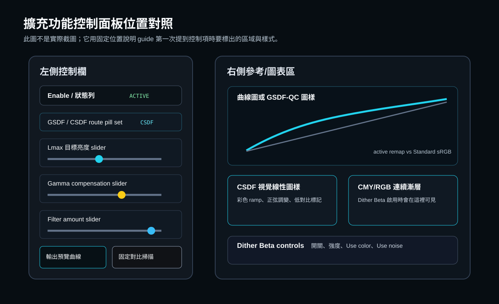
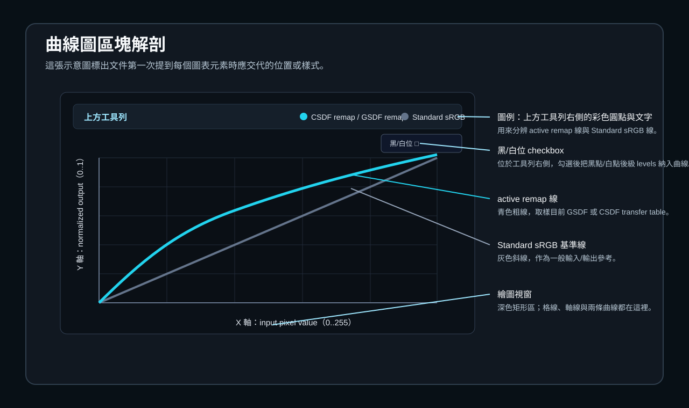
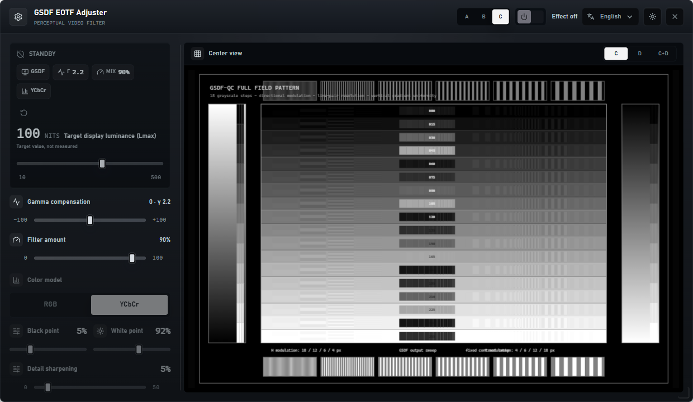
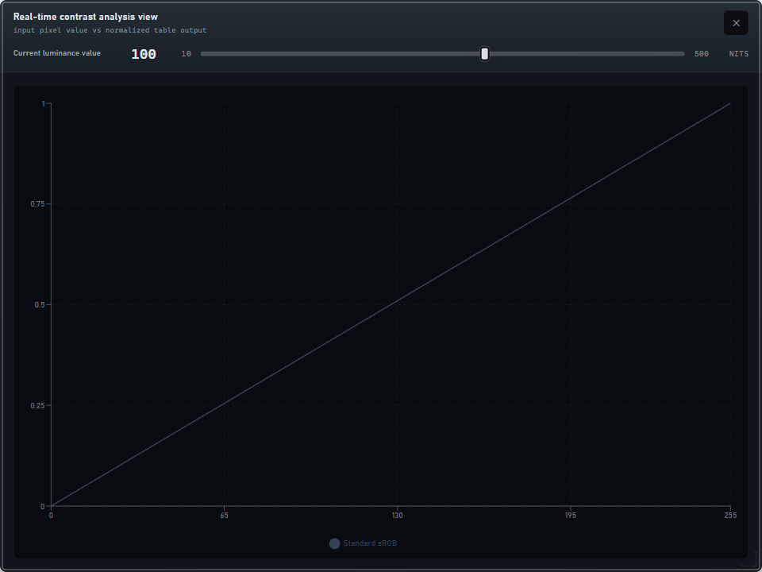
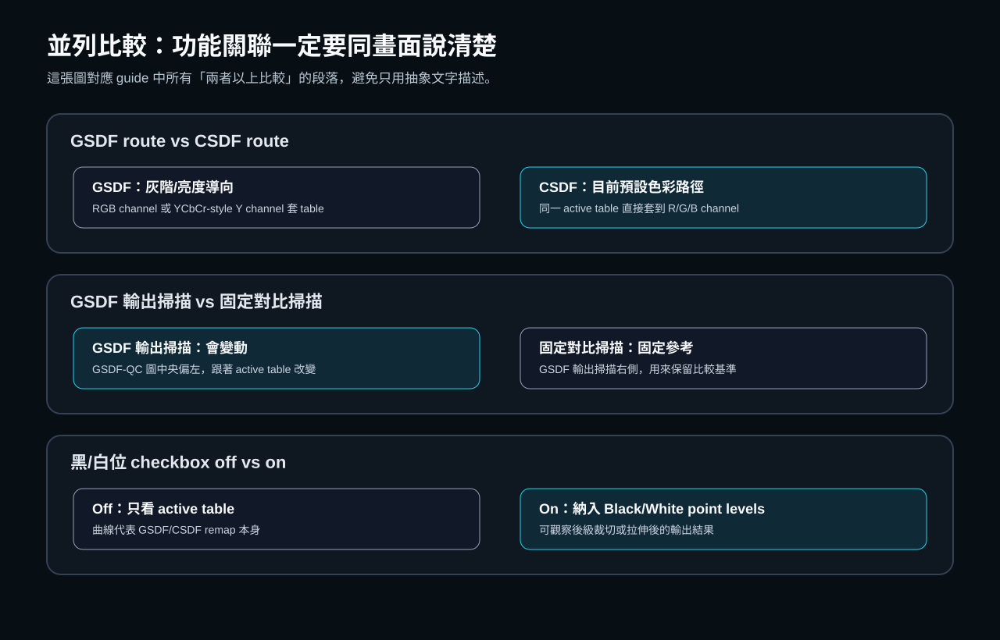
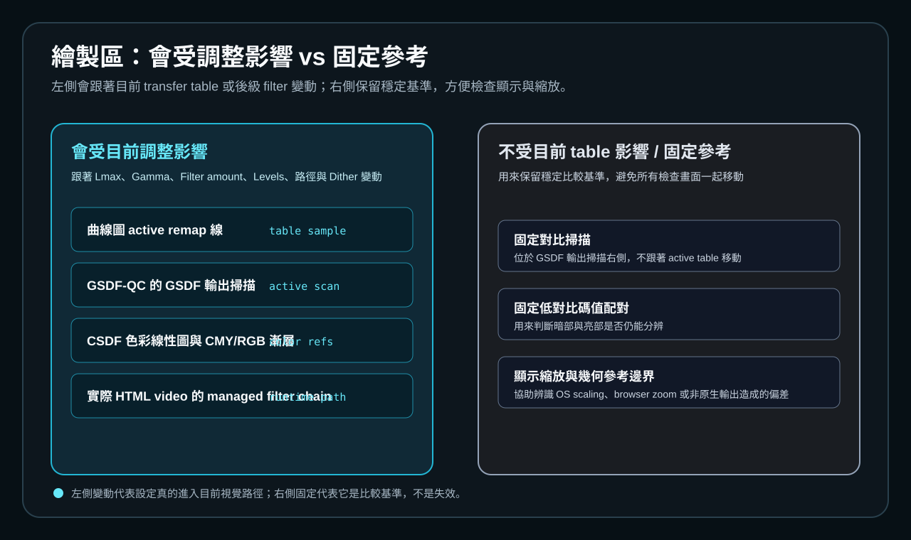

# GSDF / CSDF 圖表與擴充功能操作對照

本 guide 說明 LumaLift 擴充功能裡的 GSDF / CSDF 圖表、參考圖樣與控制項如何對照。它的目標是幫使用者判讀「目前設定會改變哪些圖像」與「哪些圖像故意保持固定」，不是用來宣稱顯示器已通過醫療 QA、DICOM conformance 或完整 CSDF 顯示器校正。

## 技術定位

本專案的 `GSDF` 路徑借用 DICOM PS3.14 Grayscale Standard Display Function 的精神：以視覺可覺差異為方向重分配灰階輸出。DICOM 標準本身包含實際顯示器特性量測與 conformance 方法；本擴充功能是在瀏覽器濾鏡路徑中建立一張 tone transfer table，因此只能稱為觀看輔助與 GSDF-inspired remap。

本專案的 `CSDF` 路徑借用 Kimpe 等人在 Medical Physics 提出的 Color Standard Display Function 概念：把灰階感知線性化的思路延伸到色彩。本擴充功能目前是把 active transfer table 套到 RGB 或色彩參考圖樣上，沒有做完整顯示器量測、色度計流程、3D LUT 或正式 QA，所以應稱為 CSDF-inspired color remap。

瀏覽器端實作依賴 SVG / CSS filter。實際影片路徑會在 `extension/content.js` 裡組出 managed filter chain，順序是 detail sharpening、tone transfer、levels、temperature、color、dither。曲線圖只是把同一組設定取樣畫出來，方便你理解方向。

## 先認得整個畫面

上面兩張示意圖先回答「在哪裡」。下面這張截圖則保留目前擴充功能展開時的實際視覺比例。

## 元素索引

每個名稱第一次出現時，都在這裡標出位置或樣式。後文再次使用同一名稱時，請回到這張索引對照。

| 元素名稱 | 第一次辨認方式 | 作用 | 程式碼依據 |
| --- | --- | --- | --- |
| `啟用狀態開關` | 面板標題列右側的深色圓角長按鈕；左半是電源圖示滑塊，右半顯示 `ACTIVE` 或 `STANDBY` | 開關整個 EOTF / tone remap；關閉時實際濾鏡不套用，曲線圖也不畫 active remap 線 | `src/components/DraggablePanel.tsx:4224` |
| `校正路徑狀態條` | 緊接在啟用狀態開關右側的窄長狀態條；上方小字是「校正路徑」，下方顯示目前 route | 快速確認目前是 `GSDF 灰階路徑` 或 `CSDF 色彩路徑` | `src/components/DraggablePanel.tsx:1535` |
| `目標顯示亮度（Lmax）` | Basic 分頁上方的大型數字讀值；字體最大，旁邊標示 `nits`，下方是水平 range slider | 建立 active transfer table 的目標峰值亮度；這是目標值，不是自動量測值 | `src/components/DraggablePanel.tsx:1562` |
| `Gamma 補償` | Basic 分頁 Lmax 下方的滑桿列；左側有 Activity 圖示，右側同列有「顯示裝置使用」select | 在 active transfer table 前後加入 gamma 方向補償；中心 0 代表不額外偏移 | `src/components/DraggablePanel.tsx:3637` |
| `輸出預覽圖表` | Basic 分頁中段的 177px 高深色圖表框；左上工具列標題顯示「輸出預覽」 | 以曲線方式顯示 active remap 與 Standard sRGB 的差異 | `src/components/DraggablePanel.tsx:3671` |
| `Filter amount` | Basic 分頁輸出預覽圖表下方的 compact control；右側數值是百分比 | 控制完整 GSDF / CSDF table 混入 baseline 的比例 | `src/components/DraggablePanel.tsx:3673` |
| `active remap 線` | 曲線圖裡的青色粗線；圖例文字會顯示 `GSDF remap` 或 `CSDF remap` | 取樣目前設定產生的 active transfer table | `src/components/GSDFChart.tsx:206` |
| `Standard sRGB 基準線` | 曲線圖裡的灰藍色斜線；圖例文字是 `Standard sRGB` | 固定參考線，用來看 active remap 相對一般輸入/輸出線性參考偏到哪裡 | `src/components/GSDFChart.tsx:197` |
| `黑/白位 checkbox` | 曲線圖上方工具列右側的小型 checkbox；文字標籤是「黑/白位」 | 只改變曲線圖顯示方式：把黑點/白點後級 levels 納入曲線視圖 | `src/components/GSDFChart.tsx:147` |
| `公式切換 GSDF/CSDF` | Advanced 分頁上方「校正路徑」區塊內的兩段式 pill control | 切換 active transfer table 的 route | `src/components/DraggablePanel.tsx:3706` |
| `GSDF pipeline RGB/YCbCr` | Advanced 分頁中，只有在公式切到 GSDF 時才出現；位於公式切換下一列 | 決定 GSDF route 是直接處理 RGB channel，或用 YCbCr-style 亮度通道處理 | `src/components/DraggablePanel.tsx:3714` |
| `顯示色域` | Advanced 分頁的 segmented control；選項是 `sRGB`、`Display P3`、`Adobe RGB` | 提供 YCbCr-style luma matrix 與色彩參考圖樣使用的 gamut 假設 | `src/components/DraggablePanel.tsx:3728` |
| `黑點 / 白點控制` | Advanced 分頁的兩個並排 compact controls；左邊是「黑點」，右邊是「白點」 | 改變後級 levels；會影響實際濾鏡路徑，曲線圖只有在黑/白位 checkbox 勾選時才把它畫進來 | `src/components/DraggablePanel.tsx:3745` |
| `參考側邊欄` | 面板右側展開的深色側欄；上方有「參考圖與曲線」標題與關閉按鈕 | 顯示 GSDF-QC、CSDF 色彩、漸層、曲線四種參考視圖 | `src/components/DraggablePanel.tsx:3140` |
| `參考模式切換` | 參考側邊欄頂部的一排 icon + text segmented buttons；文字是 `GSDF 圖`、`CSDF 色彩`、`漸層`、`曲線` | 在四種參考視圖之間切換 | `src/components/DraggablePanel.tsx:2615` |
| `GSDF-QC 參考圖` | `GSDF 圖` 模式中的黑底 canvas；有外框、18 條水平灰階列、左右垂直漸層與線對圖樣 | 用於同時比較會變動的 GSDF 輸出掃描與固定參考 | `src/components/DraggablePanel.tsx:1853` |
| `GSDF 輸出掃描` | GSDF-QC 參考圖中央偏左的窄直欄；底部標籤為 `GSDF 輸出掃描` | 跟著 active transfer table 改變，適合觀察目前 remap 對灰階間距的影響 | `src/components/DraggablePanel.tsx:1899` |
| `固定對比掃描` | GSDF-QC 參考圖中，緊貼 GSDF 輸出掃描右側的窄直欄；底部標籤為 `固定對比掃描` | 不跟著 active transfer table 改變，保留穩定比較基準 | `src/components/DraggablePanel.tsx:1901` |
| `CSDF 視覺線性圖樣` | `CSDF 色彩` 模式中的六列彩色 canvas；每列比較一組色彩方向，例如 R-Y、R-M、B-C | 觀察色彩路徑在不同 hue pair 上是否出現不連續或局部壓縮 | `src/components/DraggablePanel.tsx:2524` |
| `CMY/RGB 連續漸層` | `漸層` 模式中的滿版單一連續色帶；由 CMY 方向平滑過渡到 RGB 方向 | 觀察 banding、色彩跳階與 dither 的視覺效果 | `src/components/DraggablePanel.tsx:2439` |
| `Dither Beta` | 只在 `漸層` 模式頂部出現的控制區；包含主開關、強度 slider、`使用彩色` 與 `使用 Noise` checkbox | 套用到實際影片濾鏡輸出與 CMY/RGB 連續漸層參考圖 | `src/components/DraggablePanel.tsx:1176` |
| `managed filter chain` | 不是畫面元件；是 content script 對影片元素組出的 CSS/SVG filter 串 | 決定真正在影片上套用的順序：sharpen -> transfer -> levels -> temperature -> color -> dither | `extension/content.js:744` |

## 曲線圖如何讀

曲線圖的 X 軸是輸入 pixel value，範圍 0 到 255；Y 軸是 normalized output，範圍 0 到 1。圖表本身不代表畫質分數，而是顯示目前 remap 方向。

| 並列元素 | 左側 / 固定參考 | 右側 / 目前設定 |
| --- | --- | --- |
| `Standard sRGB 基準線` vs `active remap 線` | Standard sRGB 基準線是灰藍斜線，固定不動，用來表示一般線性參考 | active remap 線是青色粗線，會隨 Lmax、Gamma 補償、Filter amount、route、色域與黑白點設定改變 |
| 暗部區域 | 若 active remap 線高於 Standard sRGB，暗部輸出被抬高 | 可幫助霧、陰影或低亮度細節變得可見，也可能讓黑位變灰 |
| 亮部區域 | 若 active remap 線趨平或低於 Standard sRGB，亮部輸出被壓縮 | 可保留部分高光層次，也可能降低亮部對比 |

`黑/白位 checkbox` 的重點是「曲線視圖是否納入後級 levels」。它不會切換 DICOM 公式，也不是新的 route。

| 黑/白位 checkbox 狀態 | 曲線圖看到的東西 | 適合判讀 |
| --- | --- | --- |
| 未勾選 | active remap 線只代表 GSDF / CSDF table 本身 | 先看核心 tone curve 是否過度抬暗部或壓亮部 |
| 已勾選 | active remap 線再加上黑點 / 白點控制造成的裁切或拉伸 | 檢查後級 levels 是否讓暗部被截掉、亮部被推滿或中間調被拉伸 |

## 控制項如何影響圖表

| 控制項 | 位置與樣式 | 調整後最先看哪裡 | 常見判讀 |
| --- | --- | --- | --- |
| `目標顯示亮度（Lmax）` | Basic 上方大數字 + range slider | active remap 線、GSDF 輸出掃描、CSDF 視覺線性圖樣、CMY/RGB 連續漸層 | 數值提高或降低會改變整張 tone table 的分配；它不是螢幕實測亮度 |
| `Gamma 補償` | Basic 中段 slider，右側有顯示 gamma select | active remap 線的中間調形狀 | 右移通常偏向提亮中低調；過量會讓陰影變浮 |
| `Filter amount` | Basic 下方百分比 compact control | active remap 線與受調整圖樣的變化強度 | 0% 接近 baseline，100% 接近完整 table；中間值是混合 |
| `公式切換 GSDF/CSDF` | Advanced 的 route pill control | 圖例文字、active remap 線、參考色彩圖樣 | GSDF 偏灰階/亮度導向；CSDF 偏色彩路徑 |
| `顯示色域` | Advanced 的 sRGB / Display P3 / Adobe RGB segmented control | GSDF YCbCr pipeline 與色彩參考圖樣 | 改的是 gamut 假設，不等於讀取顯示器 ICC 實測資料 |
| `黑點 / 白點控制` | Advanced 兩個並排 compact controls | 實際影片、黑/白位 checkbox 勾選後的曲線 | 用於後級 levels；太激進會造成裁切 |
| `Dither Beta` | 參考側邊欄的 `漸層` 模式上方 | CMY/RGB 連續漸層與實際影片濾鏡輸出 | 用來檢查 banding；啟用後可能改善條帶，也可能讓細紋或 noise 更明顯 |

## GSDF 與 CSDF 並列比較

| 項目 | GSDF route | CSDF route |
| --- | --- | --- |
| 畫面位置 | Advanced 分頁 `公式切換 GSDF/CSDF` 中選 `GSDF` | Advanced 分頁同一個 pill control 中選 `CSDF` |
| 圖例文字 | 曲線圖圖例顯示 `GSDF remap` | 曲線圖圖例顯示 `CSDF remap` |
| 處理方向 | 灰階 / 亮度導向，適合先看 luminance 分配 | 色彩路徑導向，適合彩色影片或色彩參考圖樣 |
| pipeline 選項 | 會額外顯示 `GSDF pipeline RGB/YCbCr` | 不顯示 GSDF pipeline；直接走 CSDF 色彩路徑 |
| 技術邊界 | 借用 DICOM GSDF 的 JND / luminance 概念，但沒有執行顯示器量測 conformance | 借用 CSDF paper 的 color perceptual linearization 概念，但不是完整顯示器校正流程 |

GSDF route 裡還有 RGB 與 YCbCr-style 兩種 pipeline。這兩者必須並列看，因為它們不是強弱差異，而是作用通道不同。

| 項目 | GSDF RGB pipeline | GSDF YCbCr-style pipeline |
| --- | --- | --- |
| 畫面位置 | Advanced 分頁，公式為 GSDF 時的 `GSDF pipeline RGB/YCbCr` row | 同一 row 的另一個選項 |
| 作用方式 | 對 RGB channel 套 table | 用顯示色域的 luma matrix 分離亮度方向，再處理 Y channel |
| 適合觀察 | RGB channel remap 是否造成色彩相對位置改變 | 亮度主導的灰階或低彩度內容 |
| 會受 `顯示色域` 影響嗎 | 較少，主要直接看 RGB | 會，因為 luma matrix 來自顯示色域設定 |

## 參考圖如何分成會變動與固定參考

這是本 guide 最重要的分界：不是所有出現在繪製區的圖像都應該跟著設定變。若所有圖像都一起移動，使用者就失去穩定基準。

| 分類 | 圖像或元件 | 為什麼會變動或固定 |
| --- | --- | --- |
| 會受調整影響 | active remap 線 | 直接取樣 `buildActiveTransferTableValues(settings)` |
| 會受調整影響 | GSDF 輸出掃描 | 由目前 settings 建立的灰階 row 產生 |
| 會受調整影響 | CSDF 視覺線性圖樣 | 使用 active transfer table 與色彩路徑繪製 |
| 會受調整影響 | CMY/RGB 連續漸層 | 使用 active transfer table；Dither Beta 啟用時也會疊入 dither |
| 會受調整影響 | 實際影片濾鏡輸出 | 由 managed filter chain 套到頁面影片元素 |
| 固定參考 | Standard sRGB 基準線 | 用來提供不變的曲線參考 |
| 固定參考 | 固定對比掃描 | 用固定 +2 或 +8 code value 差異保留對比基準 |
| 固定參考 | GSDF-QC 的外框、標題、灰階 row 標籤、線對與左右垂直漸層 | 用來確認縮放、視覺解析與背景分布，不跟著 active table 改 |

`GSDF 輸出掃描` 與 `固定對比掃描` 要一起看：

| 並列元素 | 位置 | 判讀方式 |
| --- | --- | --- |
| GSDF 輸出掃描 | GSDF-QC 參考圖中央偏左的窄直欄 | 若設定改變後掃描欄的低階或高階差異更可見，代表 remap 正在改變輸出間距 |
| 固定對比掃描 | GSDF 輸出掃描右側的窄直欄 | 若固定掃描本來就看不清楚，可能是顯示器亮度、環境光、縮放或瀏覽器渲染造成，不應只怪 tone table |

`CSDF 視覺線性圖樣` 與 `CMY/RGB 連續漸層` 也要並列看：

| 並列元素 | 位置 | 適合看什麼 |
| --- | --- | --- |
| CSDF 視覺線性圖樣 | 參考側邊欄 `CSDF 色彩` 模式；六列色彩方向 | 看不同 hue pair 的低對比區是否突然斷裂或偏色 |
| CMY/RGB 連續漸層 | 參考側邊欄 `漸層` 模式；滿版單一連續色帶 | 看長距離漸層是否出現 banding、色帶或 dither 紋理 |

`Dither Beta` 開關也要用 off / on 並列判讀：

| Dither Beta 狀態 | 視覺結果 | 判讀 |
| --- | --- | --- |
| Off | CMY/RGB 連續漸層只顯示 tone remap 後的平滑色帶 | 先確認 banding 是否來自 tone curve 或瀏覽器色彩路徑 |
| On + 使用 Noise | 會加入亮度 noise 成分 | 可能打散 banding，但也可能讓暗部細節看起來更粗 |
| On + 使用彩色 | 會加入彩色 channel offset 成分 | 可能打散彩色 banding，但也可能產生彩色細紋 |

## 建議操作順序

1. 先看面板標題列右側的 `啟用狀態開關`，確認是 `ACTIVE`。
2. 看 `校正路徑狀態條`，確認目前 route 是 GSDF 還是 CSDF。
3. 在 Basic 分頁調 `目標顯示亮度（Lmax）`，把它當作目標假設，不要當成螢幕實測值。
4. 用 `Gamma 補償` 做小幅修正，先避免大幅抬升暗部。
5. 調 `Filter amount`，從較低比例往上加，找到最低足夠強度。
6. 看 `輸出預覽圖表`，比較 active remap 線與 Standard sRGB 基準線。
7. 勾選 `黑/白位 checkbox`，確認黑點 / 白點控制是否造成後級裁切或拉伸。
8. 打開 `參考側邊欄`，在 `GSDF 圖` 內並列看 GSDF 輸出掃描與固定對比掃描。
9. 若是彩色影片，切到 `CSDF 色彩` 與 `漸層`，並列看 CSDF 視覺線性圖樣與 CMY/RGB 連續漸層。
10. 只有在看到 banding 或色帶時，再開 `Dither Beta`，並比較 off / on 的差異。

## 限制與不要過度解讀的地方

曲線變化不是畫質分數。active remap 線看起來更彎，不代表畫面一定更好；它只代表目前設定正在重新分配輸出。

Lmax 是目標假設，不是量測。若沒有外部儀器，guide 只能說明「如果把顯示峰值視為這個值，曲線會如何變」，不能說明螢幕實際已達到該亮度。

CSDF route 是 color remap path，不是正式 CSDF 顯示器校正。正式 CSDF 需要顯示器特性量測、色彩差異模型與 QA 方法；本專案目前提供的是瀏覽器端觀看輔助。

固定參考不代表無用。固定對比掃描、Standard sRGB 基準線與 GSDF-QC 的固定圖樣故意不跟著設定移動，才能讓你分辨「設定改變」與「顯示環境本來就看不清楚」。

## 程式碼閱讀依據

本 guide 依 2026-07-05 的程式碼閱讀結果撰寫，重點檔案如下：

| 檔案 | 讀取重點 |
| --- | --- |
| `src/components/GSDFChart.tsx` | 曲線圖、圖例、黑/白位 checkbox、Standard sRGB 線、active remap 線 |
| `src/components/DraggablePanel.tsx` | 擴充功能控制面板、參考側邊欄、GSDF-QC、CSDF 色彩圖樣、CMY/RGB 連續漸層、Dither Beta |
| `src/types.ts` | settings normalization 與 `buildActiveTransferTableValues(settings)` |
| `extension/content.js` | 實際影片 managed filter chain 與 SVG filter 注入 |
| `src/i18n/locales.ts` | zh-TW UI 文字，例如 `黑/白位`、`GSDF 輸出掃描`、`固定對比掃描` |

## 參考資料

- [DICOM PS3.14: Grayscale Standard Display Function](https://dicom.nema.org/medical/dicom/current/output/html/part14.html) - GSDF 的標準來源，包含 luminance / JND 與 conformance 方法。
- [DICOM Part 14 overview](https://dicom.nema.org/medical/dicom/current/output/chtml/part01/sect_6.14.html) - DICOM 對 PS3.14 目的與 display consistency 的摘要。
- [Kimpe et al., Color standard display function: A proposed extension of DICOM GSDF](https://aapm.onlinelibrary.wiley.com/doi/10.1118/1.4959544) - CSDF 概念的主要論文來源；可搭配 [PubMed record](https://pubmed.ncbi.nlm.nih.gov/27587031/) 查閱摘要與書目資訊。
- [ICC White Paper 44: Visualization of medical content on color display systems](https://archive.color.org/files/whitepapers/ICC_White_Paper44_Visualization_of_colour_on_medical_displays-v2.pdf) - 說明醫療顯示色彩視覺化與 CSDF 相關背景。
- [CIE / ISO CIEDE2000 colour-difference formula](https://cie.co.at/publications/colorimetry-part-6-ciede2000-colour-difference-formula-0) - 色彩差異模型的正式標準頁面，用於理解 CSDF 類方法為何需要色彩差異度量。
- [W3C SVG Filter Effects: feComponentTransfer](https://www.w3.org/TR/SVG11/filters.html) - 瀏覽器 SVG filter 與 component transfer 的規格基礎。
- [AAPM TG18 / Medical display performance assessment](https://pubmed.ncbi.nlm.nih.gov/15895604/) - 顯示器 QA 與 performance assessment 需要獨立方法與測試流程的背景。
