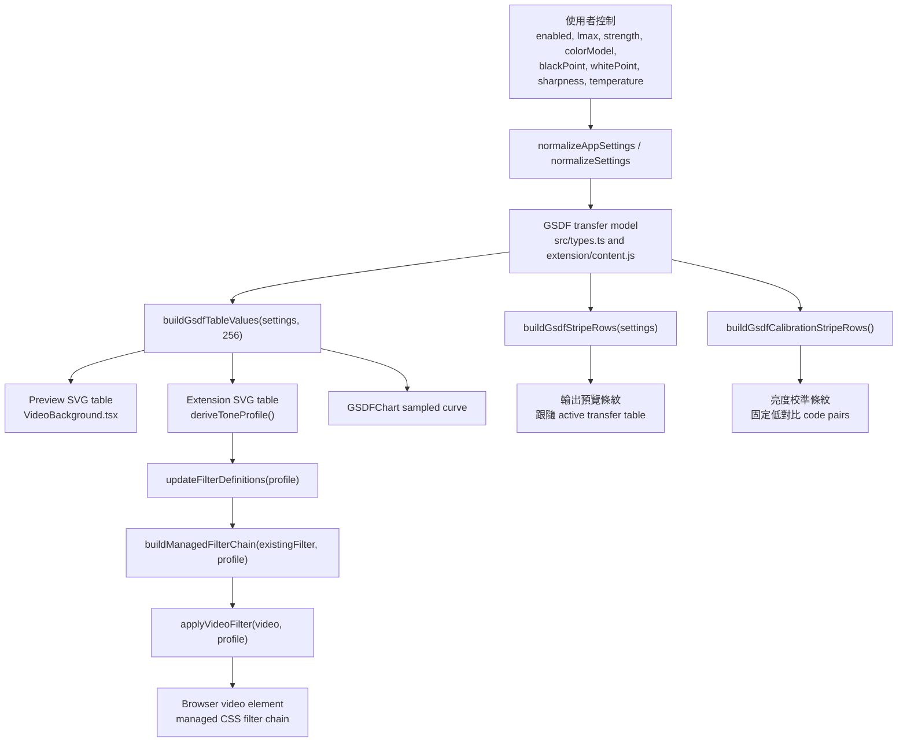
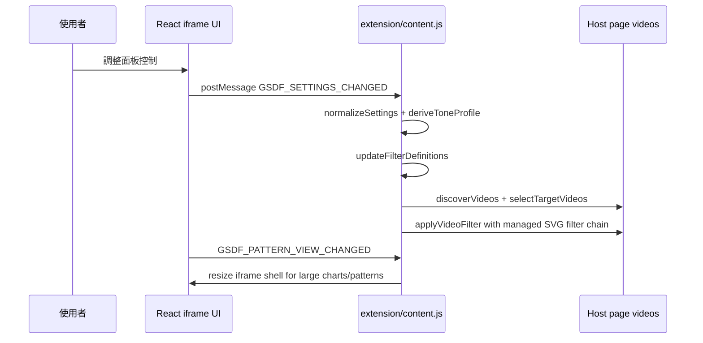

# GSDF 模型說明

這份文件說明本專案為什麼使用 GSDF-inspired transfer model、公式來源，以及目前如何把模型實作成瀏覽器影片濾鏡。

## 目的

這個 extension 會調整網頁影片，讓暗部到亮部的灰階階調更接近感知亮度尺度。它的定位是實用的顯示預覽與視覺調整，不是醫療設備校正，也不宣稱 DICOM conformance。

這個模型有用的原因是：一般影片 code value 並不等同於人眼感知上的等距亮度差。DICOM PS3.14 定義了 Grayscale Standard Display Function (GSDF)，用 Just-Noticeable Difference (JND) index 與 luminance 建立對應關係。本專案借用這個 luminance/JND 關係，產生瀏覽器影片可用的 SVG component-transfer table。

## 公式來源

來源是 DICOM PS3.14, Grayscale Standard Display Function：

- Current HTML standard: https://dicom.nema.org/medical/dicom/current/output/html/part14.html
- Current PDF standard: https://dicom.nema.org/medical/dicom/current/output/pdf/part14.pdf

PS3.14 定義 luminance `L`，單位為 `cd/m^2`，作為 JND index `j` 的函數；其中 `j` 的範圍是 `1..1023`。本專案實作的標準插值公式如下：

```text
log10(L(j)) =
  (a + c*ln(j) + e*ln(j)^2 + g*ln(j)^3 + m*ln(j)^4)
  /
  (1 + b*ln(j) + d*ln(j)^2 + f*ln(j)^3 + h*ln(j)^4 + k*ln(j)^5)
```

係數使用 PS3.14 的數值：

```text
a = -1.3011877
b = -2.5840191e-2
c =  8.0242636e-2
d = -1.0320229e-1
e =  1.3646699e-1
f =  2.8745620e-2
g = -2.5468404e-2
h = -3.1978977e-3
k =  1.2992634e-4
m =  1.3635334e-3
```

實作採用標準描述的 luminance range：約 `0.05` 到 `4000 cd/m^2`。目前 regression tests 會檢查模型端點：`JND 1 -> ~0.05 cd/m^2`、`JND 1023 -> ~3993 cd/m^2`。

## 實作方式

共用 TypeScript 實作在 [src/types.ts](../src/types.ts)。Chrome content script 在 [extension/content.js](../extension/content.js) 內保留同一套邏輯，因為它需要作為獨立 injected script 執行。

核心流程如下：

1. 用 `normalizeAppSettings` 正規化設定。
2. 將每個 `0..1` input code level 映射到 display minimum 與 selected maximum luminance 之間的 target JND position。
3. 用 `gsdfJndToLuminance` 將 JND 轉回 luminance。
4. 將 luminance 正規化為 `0..1`。
5. 以 `pow(level, 1 / 2.2)` 轉成較適合 browser transfer table 的輸出值。
6. 產生 256 個數值，填入 SVG `feComponentTransfer` table。

第 5 步是 extension 的瀏覽器近似，不屬於 DICOM PS3.14 本身。它會產生實務上可用於 web video 的 encoded output value，但不會量測實際網頁、GPU path、螢幕 EOTF、HDR 模式或環境光觀看條件。

重要函式：

- `gsdfJndToLuminance(jndIndex)`：計算 PS3.14 luminance equation。
- `luminanceToGsdfJnd(luminance)`：用 binary search 反解 luminance 對應的 JND。
- `getGsdfDisplayCode(inputLevel, lmax)`：把單一 normalized code value 映射到 GSDF-shaped display code。
- `buildGsdfTableValues(settings, tableSize = 256)`：產生 UI、preview video、content script 與 chart 共用的 transfer table。
- `buildGsdfStripeRows(settings)`：產生帶有小幅 JND offset 的 stripe pairs，用於視覺檢查。

## 流程流水線圖

`src/types.ts` 雖然檔名像 type 定義，但它其實是共用模型核心。它負責 settings shape、輸入正規化、luminance/JND 計算、transfer table 產生，以及條紋列資料產生。runtime application 再從三個地方消費這些輸出：

- `src/components/VideoBackground.tsx`：用 SVG filters 渲染 standalone demo preview。
- `src/components/DraggablePanel.tsx`：把 settings 接成 UI 控制、輸出預覽條紋、亮度校準條紋與圖表 overlay。
- `extension/content.js`：鏡像同一套模型，並從 injected content script 把 SVG filters 套到真實頁面影片。



核心 table-generation loop 會把每個 input code value 送進 GSDF luminance relationship，再轉成 SVG table value：

```mermaid
flowchart LR
  A["8-bit table index"] --> B["inputLevel = index / 255"]
  B --> C["getGsdfDisplayCode(inputLevel, lmax)"]
  C --> D["luminanceToGsdfJnd(minLuminance / lmax)"]
  D --> E["interpolate target JND"]
  E --> F["gsdfJndToLuminance(jnd)"]
  F --> G["normalize luminance to 0..1"]
  G --> H["pow(level, 1 / 2.2)"]
  H --> I["與原 input 混合<br/>strength / 100"]
  I --> J["clamped 5-decimal table value"]
```



Chrome extension path 在同一個模型外面多了一層 runtime：它必須找到目標影片、保留 host page 原本的 filter token、注入可重用的 SVG definitions，並同步浮動 iframe panel 的大小與位置。



視覺化表面刻意拆成兩種用途。輸出預覽條紋會從 active transfer table 取樣，所以會反映目前選到的 `lmax`、`strength` 與 color path。亮度校準條紋則是固定 `+2` code-value reference，因此不受目前 GSDF table 影響，可作為穩定的亮度/對比檢查。

## 專案內的取捨

### 目標亮度

UI 提供的 `lmax` 範圍是 `10..500 nits`。這比 PS3.14 模型完整範圍窄，因為本 extension 目標是一般 web-video 顯示調整，不是診斷顯示器校正。

slider 使用 logarithmic scale。低亮度目標會有較細的控制，因為暗部感知差異更敏感。

### 完整 GSDF 與 Filter 總量

UI 只提供一套 GSDF 路徑。它會先依所選 target luminance 產生完整 GSDF-shaped table，再用 user-facing filter 總量把完整 table output 與原訊號混合。任何 target luminance 都不再被當作 neutral no-compensation point：

```text
filterAmount = strength/100
mixedLevel = inputLevel + (gsdfLevel - inputLevel) * filterAmount
```

`0%` 代表原訊號；`100%` 代表所選 `lmax` 下的完整 GSDF output。中間值是全域 filter 總量，不是低亮度相對補償規則。

若舊儲存設定含有 `curveMode: "pure"`，目前會正規化回這套單一 GSDF 路徑。使用者應調整 filter 總量，而不是在多套 GSDF 解讀之間切換。

### RGB vs YCbCr

`colorModel: "rgb"` 會對 R/G/B 三個 channel 套用同一張 table。`colorModel: "ycbcr"` 會先轉成 luma/chroma space，只調整 luma component，再轉回 RGB。luma-only 路徑的目的，是在強亮度修正時更好地保留 chroma 關係。

### Black/White Point、Sharpness、Temperature

這些控制是疊在 GSDF table 外面的 extension-specific 調整：

- Black/white point 使用 linear `feComponentTransfer` levels adjustment。
- Sharpness 會選擇不同強度的 `feConvolveMatrix` filter。
- Temperature 透過 `feColorMatrix` 套用 RGB channel gain。

它們不是 DICOM PS3.14 的一部分，而是本 extension 的影片調整控制。

## 限制與非目標

- extension 不會量測實體螢幕、環境光或實際輸出 luminance。
- extension 不驗證 DICOM conformance。
- extension 不能取代經校正的 medical display workflow。
- 它使用瀏覽器 SVG filters，因此輸出可能受 browser、GPU path、video pipeline 與頁面渲染方式影響。

在本專案中，GSDF 是一個讓影片預覽控制更有感知意義的 transfer model，不是認證邊界。
