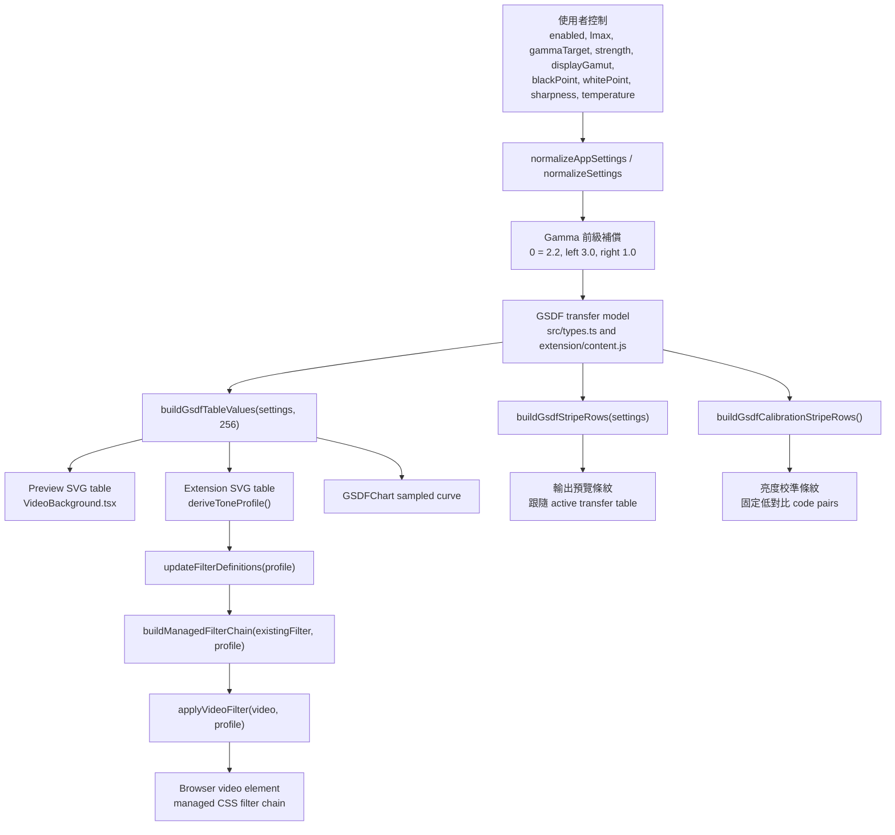
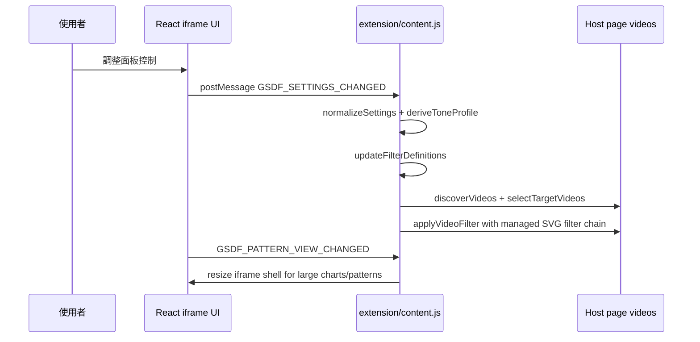

# GSDF 模型說明

這份文件說明本專案為什麼使用 GSDF-inspired transfer model、公式來源，以及目前如何把模型實作成瀏覽器影片濾鏡。

## 目的

這個 extension 會調整網頁影片，讓暗部到亮部的灰階階調更接近感知亮度尺度。它的定位是實用的顯示預覽與視覺調整，不是醫療設備校正，也不宣稱 DICOM conformance。

對一般彩色影片來說，觀影目標仍應以 gamma-style response 為主。本 extension 是特殊情境下的補救工具，例如影片沒有經過良好後期調整、螢幕 EOTF 本身不準確，或觀看條件造成影像細節流失。因此本專案在 GSDF 前面保留可調整的 Gamma 目標，再把 GSDF 視為選用的感知細節補救層。

GSDF 模型有用的原因是：一般影片 code value 並不等同於人眼感知上的等距亮度差。DICOM PS3.14 定義了 Grayscale Standard Display Function (GSDF)，用 Just-Noticeable Difference (JND) index 與 luminance 建立對應關係。本專案借用這個 luminance/JND 關係，產生瀏覽器影片可用的 SVG component-transfer table。

## 公式來源

來源是 DICOM PS3.14, Grayscale Standard Display Function：

- Current HTML standard: https://dicom.nema.org/medical/dicom/current/output/html/part14.html
- Current PDF standard: https://dicom.nema.org/medical/dicom/current/output/pdf/part14.pdf

PS3.14 定義 luminance `L`，單位為 `cd/m^2`，作為 JND index `j` 的函數；其中 `j` 的範圍是 `1..1023`。本專案實作的標準插值公式如下：

```text
log10(L(j)) =
  (a + c*ln(j) + e*ln(j)^2 + g*ln(j)^3 + m*ln(j)^4)
  /
  (1 + b*ln(j) + d*ln(j)^2 + f*ln(j)^3 + h*ln(j)^4 + k*ln(j)^5)
```

係數使用 PS3.14 的數值：

```text
a = -1.3011877
b = -2.5840191e-2
c =  8.0242636e-2
d = -1.0320229e-1
e =  1.3646699e-1
f =  2.8745620e-2
g = -2.5468404e-2
h = -3.1978977e-3
k =  1.2992634e-4
m =  1.3635334e-3
```

實作採用標準描述的 luminance range：約 `0.05` 到 `4000 cd/m^2`。目前 regression tests 會檢查模型端點：`JND 1 -> ~0.05 cd/m^2`、`JND 1023 -> ~3993 cd/m^2`。

## 實作方式

共用 TypeScript 實作在 [src/types.ts](../src/types.ts)。Chrome content script 在 [extension/content.js](../extension/content.js) 內保留同一套邏輯，因為它需要作為獨立 injected script 執行。

核心流程如下：

1. 用 `normalizeAppSettings` 正規化設定。
2. 對每個 input code level 套用目前的 Gamma 目標。UI 會以置中的補償 slider 表示：`0` 代表 gamma `2.2`，左端對應 gamma `3.0`，右端對應 gamma `1.0`。
3. 將 gamma-adjusted code level 映射到 display minimum 與 selected maximum luminance 之間的 target JND position。
4. 用 `gsdfJndToLuminance` 將 JND 轉回 luminance。
5. 將 luminance 正規化為 `0..1`。
6. 以 `pow(level, 1 / 2.2)` 轉成較適合 browser transfer table 的輸出值。
7. 用 filter 總量把完整 GSDF 結果混合回 gamma-adjusted level。
8. 產生 256 個數值，填入 SVG `feComponentTransfer` table。

第 6 步是 extension 的瀏覽器近似，不屬於 DICOM PS3.14 本身。它會產生實務上可用於 web video 的 encoded output value，但不會量測實際網頁、GPU path、螢幕 EOTF、HDR 模式或環境光觀看條件。

重要函式：

- `gsdfJndToLuminance(jndIndex)`：計算 PS3.14 luminance equation。
- `luminanceToGsdfJnd(luminance)`：用 binary search 反解 luminance 對應的 JND。
- `getGammaAdjustedInputLevel(inputLevel, gammaTarget)`：套用 GSDF 之前的 Gamma 目標。
- `getGsdfDisplayCode(inputLevel, lmax)`：把單一 normalized code value 映射到 GSDF-shaped display code。
- `buildGsdfTableValues(settings, tableSize = 256)`：產生 UI、preview video、content script 與 chart 共用的 transfer table。
- `buildGsdfStripeRows(settings)`：產生帶有小幅 JND offset 的 stripe pairs，用於視覺檢查。

## 流程流水線圖

`src/types.ts` 雖然檔名像 type 定義，但它其實是共用模型核心。它負責 settings shape、輸入正規化、luminance/JND 計算、transfer table 產生，以及條紋列資料產生。runtime application 再從三個地方消費這些輸出：

- `src/components/VideoBackground.tsx`：用 SVG filters 渲染 standalone demo preview。
- `src/components/DraggablePanel.tsx`：把 settings 接成 UI 控制、輸出預覽條紋、亮度校準條紋與圖表 overlay。
- `extension/content.js`：鏡像同一套模型，並從 injected content script 把 SVG filters 套到真實頁面影片。



核心 table-generation loop 會先套用 Gamma 目標，再把調整後的 code value 送進 GSDF luminance relationship，最後轉成 SVG table value：

```mermaid
flowchart LR
  A["8-bit table index"] --> B["inputLevel = index / 255"]
  B --> C["gammaLevel = pow(inputLevel, gammaTarget / 2.2)"]
  C --> D["getGsdfDisplayCode(gammaLevel, lmax)"]
  D --> E["luminanceToGsdfJnd(minLuminance / lmax)"]
  E --> F["interpolate target JND"]
  F --> G["gsdfJndToLuminance(jnd)"]
  G --> H["normalize luminance to 0..1"]
  H --> I["pow(level, 1 / 2.2)"]
  I --> J["與 gamma-adjusted input 混合<br/>strength / 100"]
  J --> K["clamped 5-decimal table value"]
```



Chrome extension path 在同一個模型外面多了一層 runtime：它必須找到目標影片、保留 host page 原本的 filter token、注入可重用的 SVG definitions，並同步浮動 iframe panel 的大小與位置。



視覺化表面刻意拆成兩種用途。輸出預覽條紋會從 active transfer table 取樣，所以會反映目前選到的 `gammaTarget`、`lmax`、`strength` 與 color path。亮度校準條紋則是固定 `+2` code-value reference，因此不受目前 GSDF table 影響，可作為穩定的亮度/對比檢查。

## 專案內的取捨

### 目標亮度

UI 提供的 `lmax` 範圍是 `10..500 nits`。這比 PS3.14 模型完整範圍窄，因為本 extension 目標是一般 web-video 顯示調整，不是診斷顯示器校正。

slider 使用 logarithmic scale。低亮度目標會有較細的控制，因為暗部感知差異更敏感。

### GSDF 之前的 Gamma 補償

UI 會把這個控制表述為 `Gamma 補償`，模型內部則儲存成實際的 `gammaTarget`。它刻意放在 GSDF 之前。中央 `0` 代表 gamma `2.2`，也就是一般彩色影片觀影基準；往左代表更暗觀影環境補償，最高到 gamma `3.0`；往右則補償到 gamma `1.0` 線性。

```text
gammaCorrection = -100..0..+100
gammaCorrection -100 -> gammaTarget 3.0
gammaCorrection 0 -> gammaTarget 2.2
gammaCorrection +100 -> gammaTarget 1.0
gammaLevel = pow(inputLevel, gammaTarget / 2.2)
```

這不是螢幕量測結果，而是 GSDF table 之前的一個可控前級補償，用於實務觀影補救。

### 完整 GSDF 與 Filter 總量

UI 只提供一套 GSDF 路徑。它會先套用 Gamma 目標，再依所選 target luminance 產生完整 GSDF-shaped table，最後用 user-facing filter 總量把完整 table output 與 gamma-adjusted input 混合。任何 target luminance 都不再被當作 neutral no-compensation point：

```text
filterAmount = strength/100
mixedLevel = gammaLevel + (gsdfLevel - gammaLevel) * filterAmount
```

`0%` 會保留 gamma-adjusted signal；`100%` 代表所選 `lmax` 下的完整 GSDF output。中間值是全域 GSDF filter 總量，不是低亮度相對補償規則。

若舊儲存設定含有 `curveMode: "pure"`，目前會正規化回這套單一 GSDF 路徑。使用者應調整 filter 總量，而不是在多套 GSDF 解讀之間切換。

### CSDF-inspired 顯示色域假設

UI 不再讓使用者選 RGB/YCbCr 這種工程處理路徑，而是提供顯示色域假設：`sRGB`、`Display P3`、`Adobe RGB`，三者皆以 D65 white point 處理。extension 會用所選標準 primaries 推導 luminance coefficients，建立瀏覽器 SVG filter 可執行的 luma/chroma path，再把 GSDF-shaped table 套在 luminance component 上。

這是 CSDF-inspired 近似，不是完整 CSDF calibration。完整 Color Standard Display Function workflow 需要 display characterization、以 perceptual color-difference metric 重新分配 color lines，通常也需要比 SVG filter pipeline 更完整的 3D transform。因此本專案把色域選項視為實務瀏覽器影片調整的明確假設，而不是 display compliance 證明。

### Black/White Point、Sharpness、Temperature

這些控制是疊在 GSDF table 外面的 extension-specific 調整：

- Black/white point 使用 linear `feComponentTransfer` levels adjustment。
- Sharpness 會選擇不同強度的 `feConvolveMatrix` filter。
- Temperature 透過 `feColorMatrix` 套用 RGB channel gain。

它們不是 DICOM PS3.14 的一部分，而是本 extension 的影片調整控制。

## 限制與非目標

- extension 不會量測實體螢幕、環境光或實際輸出 luminance。
- extension 不驗證 DICOM conformance。
- extension 不能取代經校正的 medical display workflow。
- 它使用瀏覽器 SVG filters，因此輸出可能受 browser、GPU path、video pipeline 與頁面渲染方式影響。

在本專案中，GSDF 是一個讓影片預覽控制更有感知意義的 transfer model，不是認證邊界。
