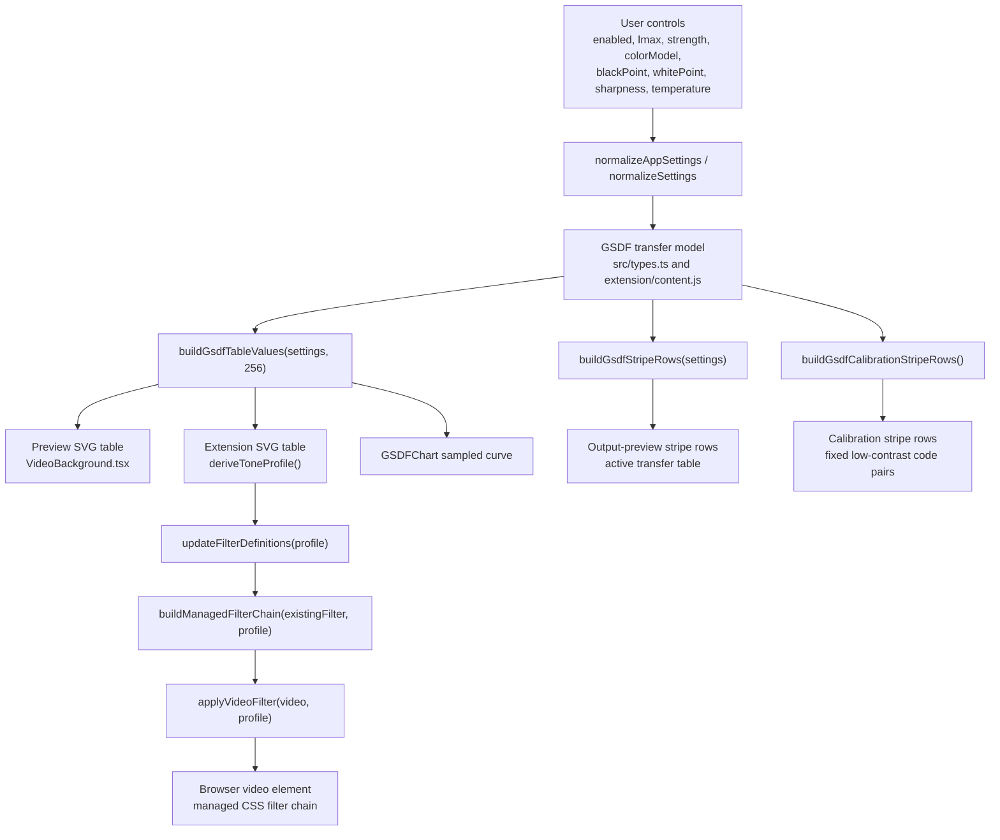
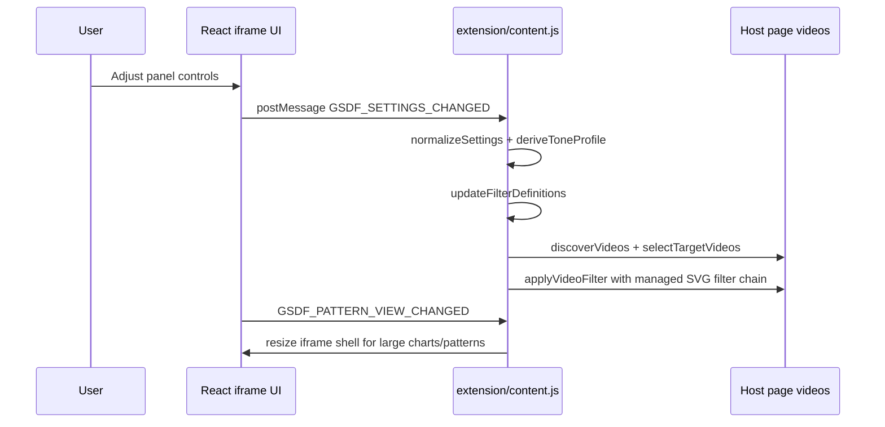

# GSDF Model Notes

This document explains why the project uses a GSDF-inspired transfer model, where the formula comes from, and how the implementation maps it into browser video filters.

## Purpose

The extension adjusts web video so dark-to-bright grayscale steps better follow a perceptual luminance scale. Its target is practical display preview and visual adjustment, not medical-device calibration or a claim of DICOM conformance.

The model is useful because normal video code values are not evenly spaced in human visual response. DICOM PS3.14 defines a Grayscale Standard Display Function (GSDF) that maps presentation values through Just-Noticeable Difference (JND) indices to luminance. The project borrows that luminance/JND relationship to build an SVG component-transfer table for browser video.

## Source Formula

The source is DICOM PS3.14, Grayscale Standard Display Function:

- Current HTML standard: https://dicom.nema.org/medical/dicom/current/output/html/part14.html
- Current PDF standard: https://dicom.nema.org/medical/dicom/current/output/pdf/part14.pdf

PS3.14 defines luminance `L` in `cd/m^2` as a function of JND index `j`, where `j` is in the range `1..1023`. The project implements the standard interpolation equation:

```text
log10(L(j)) =
  (a + c*ln(j) + e*ln(j)^2 + g*ln(j)^3 + m*ln(j)^4)
  /
  (1 + b*ln(j) + d*ln(j)^2 + f*ln(j)^3 + h*ln(j)^4 + k*ln(j)^5)
```

with the PS3.14 coefficients:

```text
a = -1.3011877
b = -2.5840191e-2
c =  8.0242636e-2
d = -1.0320229e-1
e =  1.3646699e-1
f =  2.8745620e-2
g = -2.5468404e-2
h = -3.1978977e-3
k =  1.2992634e-4
m =  1.3635334e-3
```

The implementation expects the same luminance range described by the standard: approximately `0.05` to `4000 cd/m^2`. The regression tests check the endpoints used by the model: `JND 1 -> ~0.05 cd/m^2` and `JND 1023 -> ~3993 cd/m^2`.

## Implementation

Shared TypeScript implementation lives in [src/types.ts](../src/types.ts). The Chrome content script mirrors the same logic in [extension/content.js](../extension/content.js), because it must run as a standalone injected script.

The core flow is:

1. Normalize settings with `normalizeAppSettings`.
2. Convert each input code level `0..1` into a target JND position between the display minimum and selected maximum luminance.
3. Convert that JND back to luminance with `gsdfJndToLuminance`.
4. Normalize luminance to `0..1`.
5. Convert the normalized linear display level to a browser-friendly transfer value using `pow(level, 1 / 2.2)`.
6. Store 256 values in an SVG `feComponentTransfer` table.

Step 5 is an extension approximation, not part of DICOM PS3.14. It gives the browser filter an encoded output value that is practical for web video, but it does not measure the actual page, GPU path, display EOTF, HDR mode, or ambient viewing condition.

Important functions:

- `gsdfJndToLuminance(jndIndex)`: evaluates the PS3.14 luminance equation.
- `luminanceToGsdfJnd(luminance)`: numerically inverts the equation with binary search.
- `getGsdfDisplayCode(inputLevel, lmax)`: maps one normalized code value to the GSDF-shaped display code.
- `buildGsdfTableValues(settings, tableSize = 256)`: builds the transfer table used by the UI, preview video, content script, and chart.
- `buildGsdfStripeRows(settings)`: derives small JND-offset stripe pairs for visual inspection.

## Pipeline Map

`src/types.ts` is the shared model core, despite its name. It owns the settings shape, input normalization, luminance/JND math, transfer-table generation, and stripe row generation. The runtime application then consumes those outputs in three places:

- `src/components/VideoBackground.tsx` renders the standalone demo preview with SVG filters.
- `src/components/DraggablePanel.tsx` turns settings into UI controls, output-preview stripes, calibration stripes, and chart overlays.
- `extension/content.js` mirrors the model and applies the resulting SVG filters to real page videos from an injected content script.



The core table-generation loop expands each input code value through the GSDF luminance relationship before it becomes an SVG table value:

```mermaid
flowchart LR
  A["8-bit table index"] --> B["inputLevel = index / 255"]
  B --> C["getGsdfDisplayCode(inputLevel, lmax)"]
  C --> D["luminanceToGsdfJnd(minLuminance / lmax)"]
  D --> E["interpolate target JND"]
  E --> F["gsdfJndToLuminance(jnd)"]
  F --> G["normalize luminance to 0..1"]
  G --> H["pow(level, 1 / 2.2)"]
  H --> I["blend with original input<br/>strength / 100"]
  I --> J["clamped 5-decimal table value"]
```



The Chrome extension path has one extra runtime layer around the same model. It has to discover target videos, preserve host-page filters, inject reusable SVG definitions, and keep the floating iframe panel in sync:



The visualization surfaces intentionally split two concerns. Output-preview stripes are sampled from the active transfer table, so they show the currently selected `lmax`, `strength`, and color-path behavior. Calibration stripes are fixed `+2` code-value references, so they remain a stable brightness/contrast check independent of the active GSDF table.

## Project-Specific Choices

### Target Luminance

The UI exposes `10..500 nits` for `lmax`. This range is intentionally narrower than the full PS3.14 model range because the extension is aimed at ordinary web-video display adjustment rather than diagnostic display calibration.

The slider is logarithmic. Low-luminance targets get finer control because perceptual differences are more sensitive there.

### Full GSDF and Filter Amount

The UI exposes one GSDF path. It first builds the full GSDF-shaped table for the selected target luminance, then blends that full table output with the original input by the user-facing filter amount. No target luminance is treated as a neutral no-compensation point.

```text
filterAmount = strength/100
mixedLevel = inputLevel + (gsdfLevel - inputLevel) * filterAmount
```

At `0%`, the table is the original signal. At `100%`, the table is the full GSDF output for the selected `lmax`. Intermediate values are a global filter amount, not a relative low-luminance compensation rule.

Legacy saved settings that contain `curveMode: "pure"` are normalized back to the single GSDF path. Users should choose the filter amount instead of switching between multiple GSDF interpretations.

### RGB vs YCbCr

`colorModel: "rgb"` applies the same table to red, green, and blue channels. `colorModel: "ycbcr"` converts to a luma/chroma space, adjusts the luma component, then converts back. The luma-only path is intended to preserve chroma relationships better when strong luminance correction is active.

### Black/White Point, Sharpness, and Temperature

These controls are layered around the GSDF table:

- Black/white point uses a linear `feComponentTransfer` levels adjustment.
- Sharpness chooses one of several `feConvolveMatrix` filters.
- Temperature applies RGB channel gain through `feColorMatrix`.

They are not part of DICOM PS3.14. They are extension-specific video adjustment controls.

## Limits and Non-Goals

- The extension does not measure the physical display, ambient light, or actual output luminance.
- It does not validate DICOM conformance.
- It does not replace a calibrated medical display workflow.
- It uses browser SVG filters, so output can vary by browser, GPU path, video pipeline, and page rendering behavior.

For this project, GSDF is a perceptual transfer model used to make video preview controls more meaningful. It is not a certification boundary.
